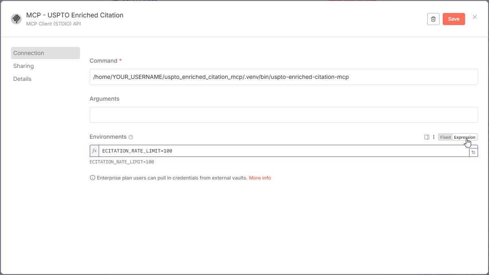
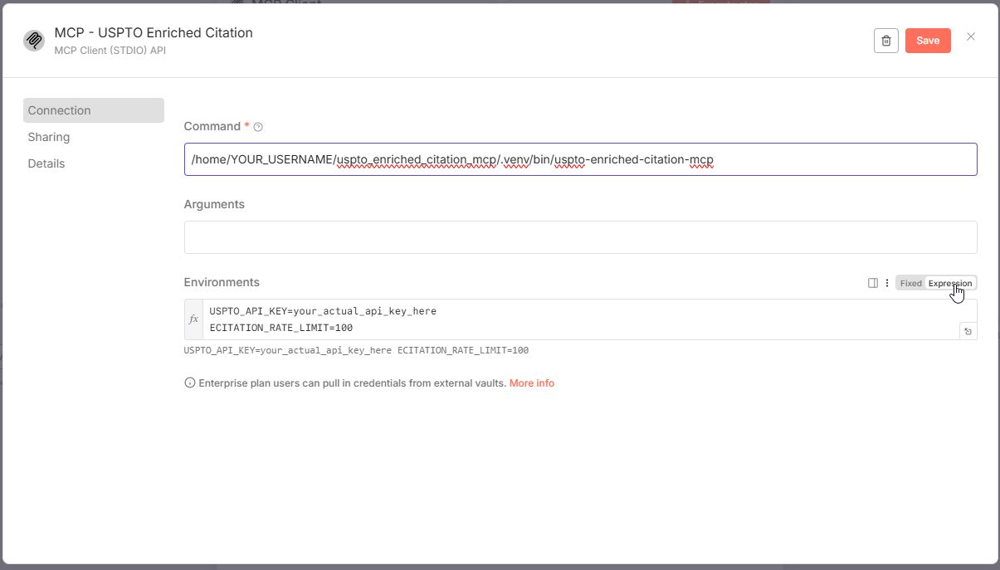
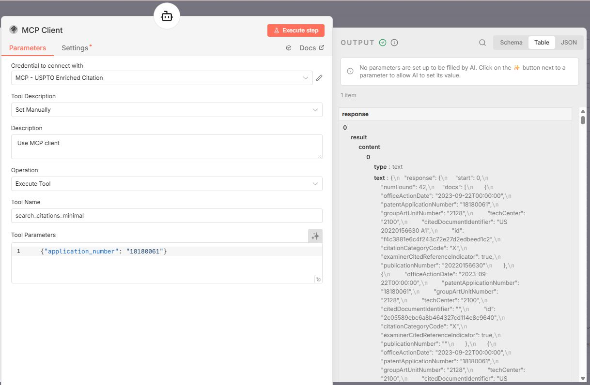

# Installation Guide - Enriched Citation MCP

Complete cross-platform installation guide using modern package managers and automated setup scripts.

## 📋 Prerequisites

- **Git** (optional) - For cloning the repository, or download ZIP manually
- **uv Package Manager** - Handles Python installation automatically (will be installed by setup script if not present)
- **USPTO API Key** (required) - Free from [USPTO Open Data Portal](https://data.uspto.gov/myodp/) - See **[API Key Guide](API_KEY_GUIDE.md)** for detailed step-by-step instructions with screenshots
- **Claude Desktop or Claude Code** - For MCP integration

> **Note:** The Enriched Citation MCP does not require a Mistral API key since it works with metadata only (no document processing). If you're also using other USPTO MCPs (PFW, PTAB, FPD) that include OCR capabilities, see the **[API Key Guide](API_KEY_GUIDE.md)** for Mistral API key instructions.

## 🚀 Quick Start Windows (Recommended)

**Run PowerShell as Administrator**, then:

```powershell
# Navigate to your user profile
cd $env:USERPROFILE

# If git is installed:
git clone https://github.com/john-walkoe/uspto_enriched_citation_mcp.git
cd uspto_enriched_citation_mcp

# If git is NOT installed:
# Download and extract the repository to C:\Users\YOUR_USERNAME\uspto_enriched_citation_mcp
# Then navigate to the folder:
# cd C:\Users\YOUR_USERNAME\uspto_enriched_citation_mcp

# The script detects if uv is installed and if it is not it will install uv - https://docs.astral.sh/uv

# Run setup script (sets execution policy for this session only):
Set-ExecutionPolicy -ExecutionPolicy Unrestricted -Scope Process
.\deploy\windows_setup.ps1

# View INSTALL.md for sample script output.
# Close Powershell Window.
# If choose option to "configure Claude Desktop integration" during the script then restart Claude Desktop
```

The PowerShell script will:

- ✅ Check for and auto-install uv (via winget or PowerShell script)
- ✅ Install dependencies and create executable
- ✅ Prompt for USPTO API key (required)
- 🔒 **Automatically store API keys securely using Windows DPAPI encryption**
- ✅ Ask if you want Claude Desktop integration configured
- 🔒 **Offer secure configuration method (recommended) or traditional method**
- ✅ Automatically merge with existing Claude Desktop config (preserves other MCP servers)
- ✅ Create timestamped backups before modifying existing configs
- ✅ Provide installation summary and next steps

**Example Windows Output:**

```
PS C:\Users\YOUR_USERNAME\uspto_enriched_citation_mcp> .\deploy\windows_setup.ps1
=== USPTO Enriched Citations MCP - Windows Setup ===
[INFO] Python NOT required - uv will manage Python automatically

[INFO] uv not found. Installing uv...
Found uv [astral-sh.uv] Version 0.9.15
This application is licensed to you by its owner.
Microsoft is not responsible for, nor does it grant any licenses to, third-party packages.
This package requires the following dependencies:
  - Packages
      Microsoft.VCRedist.2015+.x64
Successfully verified installer hash
Extracting archive...
Successfully extracted archive
Starting package install...
Path environment variable modified; restart your shell to use the new value.
Command line alias added: "uvx"
Command line alias added: "uv"
Command line alias added: "uvw"
Successfully installed
[OK] uv installed via winget
[OK] uv is now accessible: uv 0.9.15 (5eafae332 2025-12-02)
[INFO] Installing dependencies with uv...
[INFO] Installing dependencies with prebuilt wheels (Python 3.12)...
Using CPython 3.12.11
Creating virtual environment at: .venv
Resolved 62 packages in 1ms
Installed 62 packages in 1.94s
 + aiohappyeyeballs==2.6.1
 + aiohttp==3.13.2
...
 + virtualenv==20.35.3
 + yarl==1.22.0
[OK] Dependencies installed
[INFO] Verifying installation...
[WARN] Warning: Command verification failed - check PATH
[INFO] You can run the server with: uv run uspto-enriched-citation-mcp

==========================================
SECURE API KEY CONFIGURATION
==========================================

API keys will be stored in DPAPI encrypted storage
Location: ~/.uspto_api_key
Encryption: Windows Data Protection API (user + machine specific)

[INFO] Checking for existing API keys in secure storage...
[INFO] No USPTO API key found in encrypted storage
[INFO] USPTO API key is REQUIRED for Citations MCP

API Key Format Requirements:
============================

USPTO API Key:
  - Required: YES
  - Length: Exactly 30 characters
  - Format: Lowercase letters only (a-z)
  - Example: abcdefghijklmnopqrstuvwxyzabcd
  - Get from: https://data.uspto.gov/myodp/

Mistral API Key:
  - Required: NO (optional, for OCR)
  - Length: Exactly 32 characters
  - Format: Letters (a-z, A-Z) and numbers (0-9)
  - Example: AbCdEfGh1234567890IjKlMnOp1234
  - Get from: https://console.mistral.ai/

Enter your USPTO API key: ******************************
[OK] USPTO API key format validated (30 chars, lowercase)

[INFO] Storing API key in unified secure storage...
[OK] USPTO API key stored in unified secure storage
     Location: ~/.uspto_api_key (DPAPI encrypted)
[OK] USPTO API key stored in unified storage

[OK] Unified storage benefits:
     - Single-key-per-file architecture
     - DPAPI encryption (user + machine specific)
     - Shared across all USPTO MCPs (FPD/PFW/PTAB/Citations)
     - File: ~/.uspto_api_key

# No Mistral API key needed for Citations MCP (no documents to process)

[INFO] Configuring shared INTERNAL_AUTH_SECRET...
[OK] Using existing INTERNAL_AUTH_SECRET from unified storage
     Location: ~/.uspto_internal_auth_secret (DPAPI encrypted)
     Shared with other installed USPTO MCPs
     This secret authenticates internal MCP communication

Claude Desktop Configuration

Would you like to configure Claude Desktop integration? (Y/n): y

Claude Desktop Configuration Method:
  [1] Secure Python DPAPI (recommended) - API keys loaded from encrypted storage
  [2] Traditional - API keys stored in Claude Desktop config file

Enter choice (1 or 2, default is 1): 1
[OK] Using DPAPI encrypted storage (secure)
     API keys will be loaded automatically from encrypted storage
     No API keys will be stored in Claude Desktop config file

[INFO] Claude Desktop config location: C:\Users\YOUR_USERNAME\AppData\Roaming\Claude\claude_desktop_config.json
[INFO] Existing Claude Desktop config found
[INFO] Merging Enriched Citations MCP configuration with existing config...
[INFO] Backup created: C:\Users\YOUR_USERNAME\AppData\Roaming\Claude\claude_desktop_config.json.backup_20251206_080315
[OK] Successfully merged Enriched Citations MCP configuration!
[OK] Your existing MCP servers have been preserved
[INFO] API keys are NOT in config file (loaded from encrypted storage)
[INFO] Configuration backup saved at: C:\Users\YOUR_USERNAME\AppData\Roaming\Claude\claude_desktop_config.json.backup_20251206_080315
[OK] Claude Desktop configuration complete!

==========================================
Windows setup complete!
==========================================

Please restart Claude Desktop to load the MCP server

Configuration Summary:

  [OK] USPTO API Key: Stored in DPAPI encrypted storage
       Location: ~/.uspto_api_key (DPAPI encrypted)

  [OK] Storage Architecture: Single-key-per-file (shared across USPTO MCPs)
  [OK] Installation Directory: C:/Users/YOUR_USERNAME/uspto_enriched_citation_mcp

Security Features:
  [*] Configuration Method: DPAPI Encrypted Storage (Secure)
  [*] API keys encrypted with Windows DPAPI (user and machine specific)
  [*] API keys NOT in Claude Desktop config file
  [*] API keys NOT visible in process list (environment variables used)
  [*] API key format validation (prevents typos)
  [*] Secure password input (API keys hidden during entry)
  [*] Memory cleanup after key entry (prevents leaks)

Available Tools (6):
  - ec_search_citations_minimal (ultra-fast discovery)
  - ec_search_citations_balanced (detailed analysis)
  - ec_search_by_patent (patent-specific citations)
  - ec_search_by_examiner (examiner citation patterns)
  - ec_get_citation_details (full citation details)
  - ec_get_tool_reflections (workflow guidance)

Key Management:
  Manage keys: ./deploy/manage_api_keys.ps1
  Test keys:   uv run python tests/test_unified_key_management.py
  Cross-MCP:   Keys shared with FPD, PFW, and PTAB MCPs

Test with: ec_search_citations_minimal
Learn workflows: ec_get_tool_reflections
PS C:\Users\YOUR_USERNAME\uspto_enriched_citation_mcp>
```

## 🔒 Windows Secure Configuration Options

During the Windows setup, you'll be presented with two configuration methods:

### Method 1: Secure Python DPAPI (Recommended)

- 🔒 **API keys encrypted with Windows DPAPI**
- 🔒 **API keys not stored in Claude Desktop config file**
- ⚡ **Direct Python execution with built-in secure storage**
- ✅ **No PowerShell execution policy requirements**

**Example Configuration Generated:**

```json
{
  "mcpServers": {
    "uspto_enriched_citations": {
      "command": "C:/Users//YOUR_USERNAME/uspto_enriched_citation_mcp/.venv/Scripts/python.exe",
      "args": ["-m", "uspto_enriched_citation_mcp.main"],
      "cwd": "C:/Users/YOUR_USERNAME/uspto_enriched_citation_mcp",
      "env": {
         "INTERNAL_AUTH_SECRET": "your_selfgenerated_uspto_Cross_MCP_Shared_Secret"
      }
    }
  }
}
```

### Method 2: Traditional

- 📄 **API keys stored in Claude Desktop config file**
- 🔓 **Less secure - keys visible in config**
- ⚡ **Direct Python execution**
- ✅ **Simpler setup**

**Example Configuration Generated:**

```json
{
  "mcpServers": {
    "uspto_enriched_citations": {
      "command": "uv",
      "args": ["--directory", "C:/Users/YOUR_USERNAME/uspto_enriched_citation_mcp", "run", "uspto_enriched_citation_mcp"],
      "env": {
        "USPTO_API_KEY": "your_actual_api_key_here"
      }
    }
  }
}
```

### Windows DPAPI Secure Storage API Key Management

If you want to manage your Secure Storage API keys manually:

```
# Navigate to your user profile
cd $env:USERPROFILE

# Navigate to the Project Folder
cd uspto_enriched_citation_mcp

.\deploy\manage_api_keys.ps1

OUTPUT

USPTO MCP API Key Management
============================
MCP Type: Enriched Citations

Current API Keys:
  USPTO API Key:   **************************seto
  Mistral API Key: [Not set]

Actions:
  [1] Update USPTO API key
  [2] Update Mistral API key
  [3] Remove API key(s)
  [4] Test API key functionality
  [5] View INTERNAL_AUTH_SECRET (for manual config)
  [6] Show key requirements
  [7] Exit

Enter choice (1-7):

```

## :penguin: Quick Start Linux (Claude Code)

**Open terminal**, then:

```bash
# Navigate to your home directory
cd ~

# Clone the repository (if git is installed):
git clone https://github.com/john-walkoe/uspto_enriched_citation_mcp.git
cd uspto_enriched_citation_mcp

# If git is NOT installed:
# Download and extract the repository to ~/uspto_enriched_citation_mcp
# Then navigate to the folder:
# cd ~/uspto_enriched_citation_mcp

# Make script executable and run
chmod +x deploy/linux_setup.sh
./deploy/linux_setup.sh

# Restart Claude Code if you configured integration
```

**Note**: Claude Desktop is not available on Linux. The script configures Claude Code integration instead.

The Linux script will:

- ✅ Check for and auto-install uv package manager
- ✅ Install dependencies and create executable
- ✅ Prompt for USPTO API key (required)
- ✅ Ask if you want Claude Code integration configured
- ✅ Automatically merge with existing Claude Code config (preserves other MCP servers)
- ✅ Create timestamped backups before modifying existing configs
- ✅ Provide installation summary and next steps

**Example Linux Output:**

```
USER@debian:~/uspto_enriched_citation_mcp# ./deploy/linux_setup.sh
=== USPTO Enriched Citation MCP - Linux Setup ===

[INFO] UV will handle Python installation automatically
[INFO] uv found: uv 0.7.10
[INFO] Installing project dependencies with uv...
Using CPython 3.13.3
Creating virtual environment at: .venv
Resolved 62 packages in 0.75ms
      Built uspto-enriched-citation-mcp @ file:///USER/uspto_enriched_citation_mcp
Prepared 1 package in 190ms
░░░░░░░░░░░░░░░░░░░░ [0/60] Installing wheels...                                                                                                                                                    warning: Failed to hardlink files; falling back to full copy. This may lead to degraded performance.
         If the cache and target directories are on different filesystems, hardlinking may not be supported.
         If this is intentional, set `export UV_LINK_MODE=copy` or use `--link-mode=copy` to suppress this warning.[*]
Installed 60 packages in 17.60s
 + aiohappyeyeballs==2.6.1
 + aiohttp==3.13.2
 + aiosignal==1.4.0
...
 + uspto-enriched-citation-mcp==1.0.0 (from file:///USER/uspto_enriched_citation_mcp)
 + uvicorn==0.38.0
 + virtualenv==20.35.3
 + yarl==1.22.0
[OK] Dependencies installed successfully
[INFO] Installing USPTO Enriched Citation MCP package...
Resolved 36 packages in 25ms
      Built uspto-enriched-citation-mcp @ file:///USER/uspto_enriched_citation_mcp
Prepared 1 package in 182ms
Uninstalled 1 package in 28ms
░░░░░░░░░░░░░░░░░░░░ [0/1] Installing wheels...                                                                                                                                                     warning: Failed to hardlink files; falling back to full copy. This may lead to degraded performance.
         If the cache and target directories are on different filesystems, hardlinking may not be supported.
         If this is intentional, set `export UV_LINK_MODE=copy` or use `--link-mode=copy` to suppress this warning.[*]
Installed 1 package in 118ms
 ~ uspto-enriched-citation-mcp==1.0.0 (from file:///USER/uspto_enriched_citation_mcp)
[OK] Package installed successfully
[INFO] Verifying installation...
[OK] Package import successful - can run with: uv run uspto-enriched-citation-mcp

[INFO] API Key Configuration

[INFO] USPTO Enriched Citation API uses the standard Data Services API
[INFO] Get your free API key from: https://data.uspto.gov/myodp/

Enter your USPTO API key: [your_actual_USPTO_api_key_here[**]]

[OK] USPTO API key validated and configured


[INFO] Storing API keys in secure storage...
[INFO] Location: ~/.uspto_api_key (file permissions: 600)

DPAPI not available - storing with file permissions only
[OK] USPTO API key stored in secure storage
[INFO]     Location: ~/.uspto_api_key
[INFO]     Permissions: 600 (owner read/write only)
[OK]     Verified: File permissions are secure (600)

[INFO] Claude Code Configuration

Would you like to configure Claude Code integration? (Y/n): y
[INFO] Claude Code config location: /USER/.claude.json
[INFO] Existing Claude Desktop config found
[INFO] Merging USPTO Citation configuration with existing config...
[INFO] Backup created: /USER/.claude.json.backup_20251217_195641
SUCCESS
[OK] Successfully merged USPTO Citation configuration!
[OK] Your existing MCP servers have been preserved
OK: Secured file permissions: /USER/.claude.json (600)
[OK] Claude Code configuration complete!

[OK] Security Configuration:
[INFO]   - API key stored in secure storage: ~/.uspto_api_key
[INFO]   - File permissions: 600 (owner read/write only)
[INFO]   - API key NOT in Claude Desktop config file
[INFO]   - Shared storage across all USPTO MCPs (PFW/PTAB/FPD/Citations)

[OK] Linux setup complete!
[WARN] Please restart Claude Code to load the MCP server

[INFO] Configuration Summary:
[OK] USPTO API Key: Stored in secure storage (~/.uspto_api_key)
[OK] Dependencies: Installed
[OK] Package: Available as command
[OK] Installation Directory: /USER/uspto_enriched_citation_mcp
[OK] Security: File permissions 600 (owner only)

[INFO] Test the server:
  uv run uspto-enriched-citation-mcp --help

[INFO] Test with Claude Code:
  Ask Claude: 'Use search_citations_minimal to find citations for art unit 2854'
  Ask Claude: 'Use get_available_fields to explore citation data fields'
  Ask Claude: 'Use validate_query to check Lucene syntax for patent searches'

[INFO] Verify MCP is running:
  claude mcp list

=== Setup Complete! ===

USER@debian:~/uspto_enriched_citation_mcp# 
```

*The warnings are just uv being verbose about filesystem optimization. This is similar to seeing compiler warnings that don't affect the final program - informational but not problematic.

** When typing in the API keys no output is displayed as a security feature.

**Test Claude Code's MCP**

```
USER@debian:~/uspto_enriched_citation_mcp# claude mcp list
Checking MCP server health...

uspto_enriched_citation: uv --directory /root/mcp/uspto_enriched_citation_mcp run uspto-enriched-citation-mcp - ✓ Connected
```

**Example Configuration Generated:**

```json
{
  "mcpServers": {
    "uspto_enriched_citation": {
      "command": "uv",
      "args": [
        "--directory",
        "/root/mcp/uspto_enriched_citation_mcp",
        "run",
        "uspto-enriched-citation-mcp"
      ],
      "env": {
        "ECITATION_RATE_LIMIT": "100"
      }
    }
  }
}
```

## 🔀 n8n Integration (Linux)

For workflow automation with **locally hosted n8n instances**, you can integrate the USPTO Enriched Citation MCP as a node using nerding-io's community MCP client connector.

**Requirements:**
- ✅ **Self-hosted n8n instance** (local or server deployment)
- ✅ **n8n version 1.0.0+** (required for community nodes)
- ✅ **nerding-io's Community MPC Client node**: [n8n-nodes-mcp](https://github.com/nerding-io/n8n-nodes-mcp)
- ❌ **Cannot be used with n8n Cloud** (requires local filesystem access to MCP executables)

**For AI Agent Integration:**

- Must set `N8N_COMMUNITY_PACKAGES_ALLOW_TOOL_USAGE=true` environment variable

### Setup Steps

1. **Install n8n** (if not already installed):
   ```bash
   npm install -g n8n
   
   # Or using Docker with required environment variable
   docker run -it --rm --name n8n -p 5678:5678 \
     -e N8N_COMMUNITY_PACKAGES_ALLOW_TOOL_USAGE=true \
     n8nio/n8n
   ```

2. **Install nerding-io's Community MPC Client Node:**

   Follow the [n8n community nodes installation guide](https://docs.n8n.io/integrations/community-nodes/installation/):

   ```bash
   # Method 1: Via n8n UI
   # Go to Settings > Community Nodes > Install
   # Enter: n8n-nodes-mcp

   # Method 2: Via npm (for self-hosted)
   npm install n8n-nodes-mcp

   # Method 3: Via Docker environment
   # Add to docker-compose.yml:
   # environment:
   #   - N8N_NODES_INCLUDE=[n8n-nodes-mcp]
   ```

3. **Configure Credentials:**

   n8n MCP Configuration Example #1 (Where the install script (uspto_enriched_citation_mcp/deploy/linux_setup.sh) was used and API keys were stored in secure storage files)

   

   n8n MCP Configuration Example #2 (More traditional where API keys were not stored in secure storage files)

   

   - **Connection Type**: `Command-line Based Transport (STDIO)`
   - **Command**: `/home/YOUR_USERNAME/uspto_enriched_citation_mcp/.venv/bin/uspto-enriched-citation-mcp` (see below step 4 on how to get)
   - **Arguments**: (leave empty)
   - **Environment Variables** (Entered in as Expression):

     ```
     USPTO_API_KEY=your_actual_USPTO_api_key_here
     ECITATION_RATE_LIMIT=100
     ```

4. **Find MCP Executable Path:**
   Run in your project directory:
   
   ```bash
   cd /path/to/uspto_enriched_citation_mcp
   echo "$(pwd)/.venv/bin/uspto-enriched-citation-mcp"
   ```
   
   This will return something like:
   ```
   /home/YOUR_USERNAME/uspto_enriched_citation_mcp/.venv/bin/uspto-enriched-citation-mcp
   ```
   
   Use this full path as your command in the n8n MCP configuration.
   
5. **Add MCP Client Node:**
   - In n8n workflow editor, add "MCP Client (STDIO) API" node
   - Select your configured credentials
   - Choose operation (List Tools, Execute Tool, etc.)

6. **Test Connection:**
   - Use "List Tools" operation to see available USPTO Final Petition Decisions functions
   - Use "Execute Tool" operation with `search_citations_minimal`
   - Parameters example: `{"application_number":"18180061"}`
   - Results of the Execute Tool should look like this if everything is working correctly
   
   

### Example n8n Workflow Use Cases

- **Automated Citation Monitoring:** Schedule searches for citation patterns in specific technology areas
- **Examiner Analysis:** Regular analysis of examiner citation behavior and prior art patterns
- **Prosecution Intelligence:** Batch processing of citation decisions and reference types
- **Patent Quality Assessment:** Automated tracking of citation categories (X, Y, NPL) across portfolios

The n8n integration enables powerful automation workflows combining USPTO citation data with other business systems.

## 🔧 Configuration

### Environment Variables

**Required:**
- `USPTO_API_KEY`: Your USPTO Open Data Portal API key (required, free from [USPTO Open Data Portal](https://data.uspto.gov/myodp/))

**Optional with defaults:**
- `ECITATION_RATE_LIMIT`: Requests per minute (Default: "100")
- `API_TIMEOUT`: Request timeout in seconds (Default: "30")
- `ENABLE_CACHE`: Enable response caching (Default: "true")

**Advanced (for development/testing):**
- `LOG_LEVEL`: Logging verbosity (Default: "INFO")

### Claude Code MCP Configuration (Recommended)

**Method 1: Using Claude Code CLI**

```powershell
# Windows Powershell - uv installation (Claude Code)
claude mcp add uspto_enriched_citations -s user `
  -e USPTO_API_KEY=your_actual_api_key_here `
  -- uv --directory C:\Users\YOUR_USERNAME\uspto_enriched_citation_mcp run uspto-enriched-citation-mcp

# Linux - uv installation (Claude Code)
claude mcp add uspto_enriched_citations -s user \
  -e USPTO_API_KEY=your_actual_api_key_here \
  -- uv --directory /home/YOUR_USERNAME/uspto_enriched_citation_mcp run uspto-enriched-citation-mcp
```

### Claude Desktop Configuration

**For uv installations (recommended to use the deploy scripts so don't have to set this):**

```json
{
  "mcpServers": {
    "uspto_enriched_citations": {
      "command": "uv",
      "args": [
        "--directory",
        "C:/Users/YOUR_USERNAME/uspto_enriched_citation_mcp",
        "run",
        "uspto-enriched-citation-mcp"
      ],
      "env": {
        "USPTO_API_KEY": "your_actual_api_key_here"
      }
    }
  }
}
```

**For traditional pip installations:**
```json
{
  "mcpServers": {
    "uspto_enriched_citations": {
      "command": "python",
      "args": [
        "-m",
        "uspto_enriched_citation_mcp"
      ],
      "cwd": "C:/Users/YOUR_USERNAME/uspto_enriched_citation_mcp",
      "env": {
        "USPTO_API_KEY": "your_actual_api_key_here"
      }
    }
  }
}
```

## 📋 Manual Installation

### 1. Install uv (if not already installed)

**Windows:**
```powershell
# Direct installation (no admin rights needed)
powershell -c "irm https://astral.sh/uv/install.ps1 | iex"

# Or using winget
winget install --id=astral-sh.uv -e
```

**Linux:**
```bash
# Direct installation
curl -LsSf https://astral.sh/uv/install.sh | sh

# Add to PATH (add to ~/.bashrc for persistence)
export PATH="$HOME/.local/bin:$PATH"
```

### 2. Clone & Install

```bash
# Clone repository
git clone https://github.com/john-walkoe/uspto_enriched_citation_mcp.git
cd uspto_enriched_citation_mcp

# Install dependencies (uv handles Python automatically)
uv sync

# Install in development mode
uv pip install -e .

# Verify installation
uv run uspto-enriched-citation-mcp --help
```

### 3. Set API Keys

```bash
# Set environment variables
export USPTO_API_KEY=your_actual_api_key_here     # Linux

# Optional: Configure API settings (defaults: ECITATION_RATE_LIMIT=100, API_TIMEOUT=30)
export ECITATION_RATE_LIMIT=100                   # Rate limit per minute
export API_TIMEOUT=30                              # Request timeout in seconds

set USPTO_API_KEY=your_actual_api_key_here        # Windows Command

$env:USPTO_API_KEY="your_actual_api_key_here"     # PowerShell

# Optional: Configure API settings (PowerShell)
$env:ECITATION_RATE_LIMIT="100"                   # Rate limit per minute
$env:API_TIMEOUT="30"                              # Request timeout in seconds
```

## 🧪 Test Installation

```bash
# Direct test
uv run python tests/test_basic.py

# Test specific functionality
uv run python -c "
import asyncio
from uspto_enriched_citation_mcp.api.client import EnrichedCitationClient

async def test():
    client = EnrichedCitationClient()
    result = await client.search_records('techCenter:2100', rows=1)
    print('✅' if result else '❌', 'API test result:', 'Success' if result else 'Failed')

asyncio.run(test())
"

# Test in Claude Desktop/Code:
uspto_enriched_citations:search_citations_minimal {"criteria": "techCenter:2100", "rows": 1}
```

## 🗂️ Platform-Specific Notes

### Windows
- **Config Location:** `%APPDATA%\Claude\claude_desktop_config.json`
- **PowerShell:** Use forward slashes `/` in JSON paths even on Windows
- **Spaces in paths:** Use quotes in config files:
  ```json
  "args": ["--directory", "C:/Users/John Smith/uspto_enriched_citation_mcp", "run", "uspto-enriched-citation-mcp"]
  ```

### Linux
- **Claude Code Config Location:** `~/.claude.json`
- **Environment:** Add exports to `~/.bashrc`
- **Note:** Claude Desktop is not available on Linux - use Claude Code instead

## 🔧 Alternative Installation Methods

### Using pip (fallback if uv unavailable)

```bash
# Requires Python 3.10+ already installed
python -m pip install -e .
```

Then use this Claude Desktop config:
```json
{
  "mcpServers": {
    "uspto_enriched_citations": {
      "command": "python",
      "args": [
        "-m",
        "uspto_enriched_citation_mcp"
      ],
      "env": {
        "USPTO_API_KEY": "your_actual_api_key_here"
      }
    }
  }
}
```

## 🔍 Troubleshooting

### Common Issues

**Virtual Environment Issues (Windows Setup):**

If you encounter virtual environment creation issues:

1. **Close Claude Desktop completely** before running the setup script
2. Claude Desktop locks `.venv` files when running, preventing proper virtual environment creation
3. Run cleanup commands before setup:
   ```powershell
   # Close Claude Desktop first, then run:
   Remove-Item ./.venv -Force -Recurse -ErrorAction SilentlyContinue
   .\deploy\windows_setup.ps1
   ```

**API Key Issues:**
- **Windows**: Keys stored securely using DPAPI (no environment variables needed)
- **Linux/macOS**: Keys stored in environment variables
```bash
# Check environment variable (Linux/macOS only)
echo $USPTO_API_KEY
```
- **Test secure storage (Windows):**
  - Use the dedicated API key management script: `.\deploy\manage_api_keys.ps1`
  - See **Windows DPAPI Secure Storage API Key Management** section above for full details

**uv Not Found:**

```bash
# Reinstall uv
# Windows: winget install --id=astral-sh.uv -e
# Linux/macOS: curl -LsSf https://astral.sh/uv/install.sh | sh
```

**Import Errors:**

```bash
# Reinstall dependencies
cd uspto_enriched_citation_mcp
uv sync --reinstall
```

**Claude Desktop Config Issues:**
- Check JSON syntax with validator
- Verify file paths are correct
- Ensure API keys are set in environment or config

**Permission denied errors (Linux):**
```bash
# Fix ownership for project directory
sudo chown -R $(whoami):$(id -gn) ~/uspto_enriched_citation_mcp

# Fix executable permissions (adjust path as needed)
chmod +x ~/.pyenv/shims/uspto-enriched-citation-mcp
# OR if using system Python:
# sudo chmod +x /usr/local/bin/uspto-enriched-citation-mcp
```

### Resetting MCP Installation

**If you need to completely reset the MCP installation to run the installer again:**

**Windows Reset:**
```powershell
# Navigate to the project directory
cd C:\Users\YOUR_USERNAME\uspto_enriched_citation_mcp

# Remove Python cache directories
Get-ChildItem -Path ./src -Directory -Recurse -Force | Where-Object { $_.Name -eq '__pycache__' } | Remove-Item -Recurse -Force

# Remove virtual environment
if (Test-Path ".venv") {
    Remove-Item ./.venv -Force -Recurse -ErrorAction SilentlyContinue
}

# Now you can run the setup script again
.\deploy\windows_setup.ps1
```

**Linux/macOS Reset:**
```bash
# Navigate to the project directory
cd ~/uspto_enriched_citation_mcp

# Remove Python cache directories
find ./src -type d -name '__pycache__' -exec rm -rf {} + 2>/dev/null || true

# Remove virtual environment
rm -rf .venv

# Run setup script again
./deploy/linux_setup.sh
```

### Installation Verification

**1. Test Core Functionality:**
```bash
# Test basic functionality
uv run python tests/test_basic.py

# Test MCP server startup
uv run uspto-enriched-citation-mcp --help
```

**2. Test MCP Integration (requires Claude Code or MCP client):**

In Claude Code, try these commands:
```
# Test minimal search
uspto_enriched_citations:search_citations_minimal {"criteria": "techCenter:2100", "rows": 2}

# Test balanced search
uspto_enriched_citations:search_citations_balanced {"criteria": "patentApplicationNumber:18010777", "rows": 1}
```

**3. Verify MCP Connection:**
```bash
# If you have Claude Code CLI
claude mcp list

# Should show: uspto_enriched_citations: ... - ✓ Connected
```

Expected response format:
```json
{
  "status": "success",
  "total_results": 1234,
  "records": [...],
  "query_info": {
    "context_reduction_achieved": "90-95% vs full response"
  }
}
```

## 📊 Performance Considerations

- **Memory**: Allocate at least 256MB RAM for the MCP server
- **CPU**: Single core sufficient for most use cases
- **Storage**: Minimal storage needed (metadata only)
- **Network**: Good connectivity to api.uspto.gov

## 🛡️ Security

- Keep the USPTO API key secure
- Use HTTPS for external connections
- Consider firewall rules for the MCP server port
- Regular updates of dependencies

## 📈 Success Checklist

- [ ] Python 3.10+ installed (via uv)
- [ ] uv package manager installed
- [ ] Citations MCP package installed
- [ ] System executable created and working
- [ ] USPTO API key configured
- [ ] Claude Desktop/Code config updated
- [ ] Claude Desktop/Code restarted
- [ ] MCP server responding to test queries
- [ ] Search functions returning expected results

## 🚀 Next Steps

Once setup is complete:

1. **Test thoroughly:** Run the test suite to verify all functions
2. **Customize:** Modify field configurations in `field_configs.yaml`
3. **Explore prompts:** Try the sophisticated prompt templates in Claude Desktop/Code
4. **Monitor:** Set up logging and monitoring for production use

---

**Need help?** Check the main README troubleshooting section or examine the test scripts for working examples.