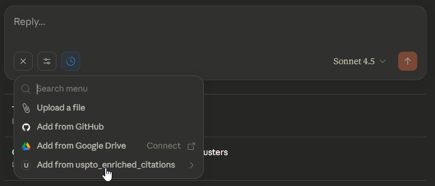
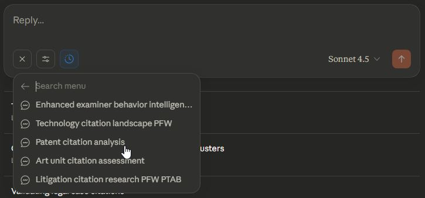
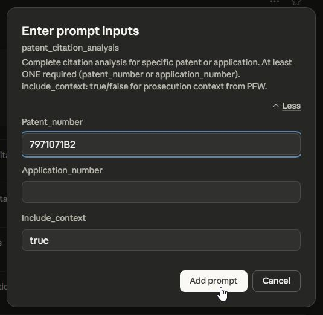
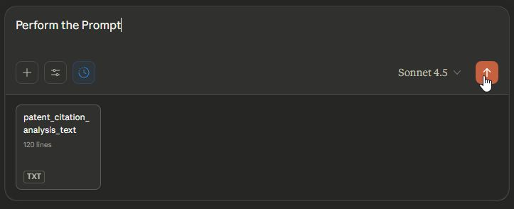

# USPTO Enriched Citation MCP - Prompt Templates

This document details the sophisticated prompt templates included with the USPTO Enriched Citation MCP Server for complex citation analysis workflows.

## ⚡️ Prompt Templates (Attorney-Friendly Workflows)

**NEW FEATURE**: The Citations MCP now includes 5 prompt templates that appear in Claude Desktop UI. These templates automate complex multi-step workflows and eliminate the need to memorize tool syntax.

### 🎯 **How to Use Prompt Templates**

1. **In Claude Desktop**: Press the `+` button

   

2. **Select "Add from uspto_enriched_citation"** from the dropdown menu

   

3. **Select the desired Prompt** from the dropdown menu. Note some prompts require the installation of the developer's other USPTO MCP servers - those requirements are denoted in the title of the Prompt, e.g. "Enhanced Examiner Behavior Intelligence PFW PTAB FPD" you would need the USPTO PFW MCP, USPTO PTAB MCP, and USPTO FPD MCP in addition to the USPTO Citations MCP

   

4. **Fill in the parameters** (patent numbers, application numbers, examiner names, etc.) Read the guidance for which fields are required and format of some fields

   

5. **Execute** - For best results type "Perform Prompt" and start the chat. Claude will run the complete workflow

   

## Overview

The MCP server includes AI-optimized prompt templates designed for patent attorneys and IP professionals. These templates provide structured workflows for common legal and research tasks, featuring flexible input processing, cross-MCP integration, and context-efficient guidance focused on citation pattern analysis and examiner behavior intelligence.

## 🎯 Legal & Patent Analysis Templates

### `/patent_citation_analysis` - Complete Patent Citation Analysis
**Purpose**: Comprehensive citation analysis for specific patent or application with prosecution context
**Key Features**:
- **Complete citation mapping**: All citations from office actions (Oct 2017+)
- **Citation effectiveness analysis**: Examiner vs applicant citations, category breakdown
- **Prosecution context**: Optional integration with PFW for complete prosecution history
- **Prior art intelligence**: Identifies citation patterns and strategic references
- **Strategic recommendations**: Actionable insights for prosecution and litigation

**Use Cases**:
- Prior art analysis for patent invalidity arguments
- Understanding examiner citation patterns for specific applications
- Litigation preparation and citation effectiveness assessment
- IDS submission strategy optimization

**Integration**: Works standalone; enhanced with Patent File Wrapper (PFW) MCP for prosecution context

---

### `/enhanced_examiner_behavior_intelligence_PFW_PTAB_FPD` - Comprehensive Examiner Profiling
**Purpose**: Complete examiner profiling combining prosecution patterns, citation behavior, petition history, and PTAB correlation
**Key Features**:
- **Four-MCP integration**: Orchestrates PFW + Citations + FPD + PTAB for complete analysis
- **Citation pattern intelligence**: Analyzes examiner citation preferences and effectiveness (Oct 2017+)
- **Allowance reasoning analysis**: Deep dive into Notice of Allowance patterns
- **Prosecution efficiency metrics**: RCE rates, final rejections, amendment patterns
- **Petition history assessment**: Quality indicators from FPD integration
- **PTAB risk profiling**: Post-grant challenge correlation analysis
- **Strategic recommendations**: Data-driven prosecution strategy guidance

**Use Cases**:
- Examiner interview preparation with citation intelligence
- Prosecution strategy optimization for specific examiners
- Art unit selection for continuation applications
- Predicting examiner response to specific argument types

**Integration**: Requires Patent File Wrapper (PFW) MCP, USPTO FPD MCP, and USPTO PTAB MCP for comprehensive analysis

---

### `/litigation_citation_research_PFW_PTAB` - Litigation Research Package
**Purpose**: Comprehensive litigation citation research combining prosecution history and PTAB proceedings
**Key Features**:
- **Integrated discovery**: Citation analysis with prosecution documents and PTAB proceedings
- **Timeline reconstruction**: Maps citation events to prosecution and post-grant milestones
- **Prior art effectiveness**: Analyzes which citations were overcome vs maintained
- **PTAB correlation**: Links citation patterns to post-grant challenge outcomes
- **Evidence compilation**: Organized materials for expert witness preparation

**Use Cases**:
- Patent litigation preparation and discovery
- Invalidity defense development with citation evidence
- PTAB petition preparation and response
- Prior art analysis for litigation strategy

**Integration**: Requires Patent File Wrapper (PFW) MCP; enhanced with USPTO PTAB MCP for post-grant analysis

## 📊 Prosecution & Research Templates

### `/technology_citation_landscape_PFW` - Technology Prior Art Mapping
**Purpose**: Map citation landscape for technology areas to identify prior art patterns
**Key Features**:
- **Technology trend analysis**: Citation patterns across tech centers and art units
- **Examiner citation preferences**: Identifies which prior art types are most effective
- **Prior art pattern recognition**: Statistical analysis of citation categories (X/Y/NPL)
- **Art unit benchmarking**: Comparative analysis across different examiners
- **Strategic prior art selection**: Recommendations based on examiner patterns

**Use Cases**:
- Prior art searches for new technology areas
- Understanding art unit citation norms before filing
- Technology landscape analysis for R&D planning
- Competitive intelligence on citation patterns

**Integration**: Requires Patent File Wrapper (PFW) MCP for application correlation

---

### `/art_unit_citation_assessment` - Art Unit Quality Assessment
**Purpose**: Analyze art unit citation norms and examiner patterns for prosecution strategy
**Key Features**:
- **Statistical citation analysis**: Average citations per office action, category distributions
- **Examiner pattern recognition**: Individual examiner citation tendencies
- **Quality metrics**: Citation effectiveness and consistency assessment
- **Benchmarking**: Comparative analysis across art units and time periods
- **Strategic recommendations**: Data-driven prosecution planning

**Use Cases**:
- Art unit selection for continuation applications
- Prosecution strategy optimization for specific art units
- Understanding citation norms before responding to office actions
- Quality assessment for patent office oversight

**Integration**: Standalone Citations analysis; enhanced with PFW MCP for prosecution correlation

## 🔧 Input Processing Features

All prompt templates include **Enhanced Input Processing** capabilities:

### Flexible Identifier Support
- **Patent Numbers**: "9049188", "US9049188B2", "9,049,188"
- **Application Numbers**: "14171705", "14/171,705", "US14/171,705"
- **Examiner Names**: "SMITH, JOHN", "Smith", partial names with wildcards
- **Art Units**: "2854", "1759", "3600"
- **Technology Keywords**: "machine learning", "wireless charging"

### Smart Validation
- **Input type detection**: Automatically determines identifier format
- **Format normalization**: Standardizes various input formats
- **Validation guidance**: Provides helpful error messages and suggestions
- **Date awareness**: Respects Oct 2017+ office action coverage

### Context Optimization
- **Progressive disclosure**: Minimal → balanced → detailed information retrieval
- **Token efficiency**: 90-99% context reduction through targeted field selection
- **Ultra-minimal mode**: Custom field selection for maximum efficiency
- **Strategic guidance**: Built-in recommendations for efficient workflows

## 📈 Performance & Integration

### Context Reduction Achievements
- **Traditional approaches**: 100KB+ responses with full API dumps
- **Optimized prompts**: 1-10KB focused responses (90-99% reduction)
- **Smart field selection**: Only retrieve data needed for specific analysis
- **Ultra-minimal mode**: Custom fields parameter for 99% token reduction

### Cross-MCP Integration Patterns
- **Citations Foundation**: All templates start with citation analysis
- **PFW Enhancement**: Prosecution history and document access
- **FPD Enrichment**: Procedural history and petition pattern analysis
- **PTAB Intelligence**: Post-grant challenge analysis and risk assessment

### Workflow Orchestration
1. **Discovery Phase**: Minimal citation searches for pattern identification
2. **Selection Phase**: Human/AI selection of relevant citations and patterns
3. **Analysis Phase**: Targeted data retrieval and structured analysis
4. **Integration Phase**: Cross-MCP data correlation and synthesis
5. **Documentation Phase**: Organized output with actionable recommendations

## 📊 Cross-MCP Integration Matrix

| Template | PFW MCP | FPD MCP | PTAB MCP | Integration Level |
|----------|---------|---------|----------|-------------------|
| Patent Citation Analysis | Optional | - | - | Context enhancement |
| Art Unit Citation Assessment | Optional | - | - | Prosecution correlation |
| **Technology Landscape** | **Required** | - | - | **Application correlation** |
| **Litigation Research** | **Required** | - | Optional | **Prosecution context** |
| **Enhanced Examiner Profiling** | **Required** | **Required** | **Required** | **Four-MCP comprehensive** |

## 🎯 Usage Recommendations

### For Patent Attorneys
- **Start with `/patent_citation_analysis`** for individual patent citation analysis with prosecution context
- **Use `/enhanced_examiner_behavior_intelligence_PFW_PTAB_FPD`** for comprehensive examiner profiling before interviews
- **Apply `/litigation_citation_research_PFW_PTAB`** for complete litigation preparation packages
- **Leverage `/art_unit_citation_assessment`** for prosecution strategy optimization

### For IP Professionals
- **Begin with `/technology_citation_landscape_PFW`** for competitive intelligence and prior art mapping
- **Employ `/art_unit_citation_assessment`** for prosecution planning and art unit selection
- **Utilize `/patent_citation_analysis`** for portfolio quality assessment
- **Use cross-MCP templates** for comprehensive lifecycle analysis

### For Research & Development
- **Apply `/technology_citation_landscape_PFW`** for R&D planning and technology roadmaps
- **Use `/art_unit_citation_assessment`** for understanding citation norms in target technology areas
- **Leverage context reduction strategies** for budget-conscious research
- **Employ ultra-minimal mode** with custom fields for maximum token efficiency

### Template Selection Guide

**Single Patent Analysis**: Use `/patent_citation_analysis` for focused citation review

**Examiner Analysis**: Use `/enhanced_examiner_behavior_intelligence_PFW_PTAB_FPD` for comprehensive examiner profiling (requires all four MCPs)

**Technology Research**: Use `/technology_citation_landscape_PFW` for prior art landscape mapping

**Litigation Prep**: Use `/litigation_citation_research_PFW_PTAB` for comprehensive case preparation

**Art Unit Assessment**: Use `/art_unit_citation_assessment` for prosecution strategy planning

## 🔧 Important Data Coverage Notes

### Office Action Date Coverage
- **Citations API**: Office actions from **October 1, 2017 to 30 days prior** to current date
- **Filing Date Strategy**: Use `date_start='2015-01-01'` to account for 1-2 year lag between filing and first office action
- **Date Filtering**: Always include `officeActionDate:[2017-10-01 TO *]` in queries

### Field Limitations
**Available Fields**: 22 total citation fields
- Core: `citedDocumentIdentifier`, `patentApplicationNumber`, `publicationNumber`
- Citations: `citationCategoryCode`, `examinerCitedReferenceIndicator`
- Context: `passageLocationText`, `relatedClaimNumberText`, `officeActionCategory`

**Fields NOT Available**:
- ❌ `examinerNameText` (use PFW → Citations workflow instead)
- ❌ `firstApplicantName`
- ❌ `decisionTypeCode` / `decisionTypeCodeDescriptionText`

### Citation Category Codes
- **X**: US patents most relevant to patentability
- **Y**: Foreign patents relevant to patentability
- **A**: US patents for background/context
- **NPL**: Non-patent literature (scientific papers, technical documents)

## 🔄 Workflow Best Practices

### Progressive Disclosure Pattern
1. **Start Minimal**: Use `search_citations_minimal` (8 fields, 90-95% reduction) for discovery
2. **Filter Results**: Identify 10-20 most relevant citations
3. **Get Details**: Use `search_citations_balanced` (18 fields, 80-85% reduction) for analysis
4. **Deep Dive**: Use `get_citation_details` for 1-5 strategically important citations

### Ultra-Minimal Mode (99% Reduction)
```python
# Override preset fields for maximum efficiency
citations = search_citations_minimal(
    criteria='patentApplicationNumber:14171705',
    fields=['citedDocumentIdentifier', 'citationCategoryCode'],  # Only 2 fields!
    rows=50
)
```

### Cross-MCP Integration Workflows

**Examiner Analysis** (PFW → Citations):
1. PFW: Find examiner's applications with ultra-minimal fields
2. Citations: Analyze citation patterns for those applications
3. Result: Comprehensive examiner citation behavior profile

**Litigation Research** (Citations → PFW → PTAB):
1. Citations: Get all citations for patent
2. PFW: Retrieve office action documents for citation context
3. PTAB: Cross-reference with post-grant proceedings
4. Result: Complete litigation research package

---

*For detailed usage examples and integration workflows, see [USAGE_EXAMPLES.md](USAGE_EXAMPLES.md).*

*For setup and installation guidance, see [README.md](README.md) and [INSTALL.md](INSTALL.md).*
